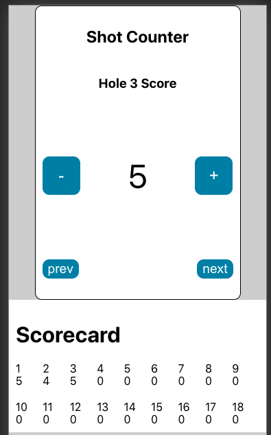

# Golf Shot Counter

This is a simple react app for practicing using state and props across components.

The component tree looks like:

- Round
    - ShotCounter
        - Counter
    - Scorecard
        - ScorecardScore

## Features

- Count shots with a counter. 
- Switch between holes and update the score for that hole. 
- See all scores below on a scorecard.

